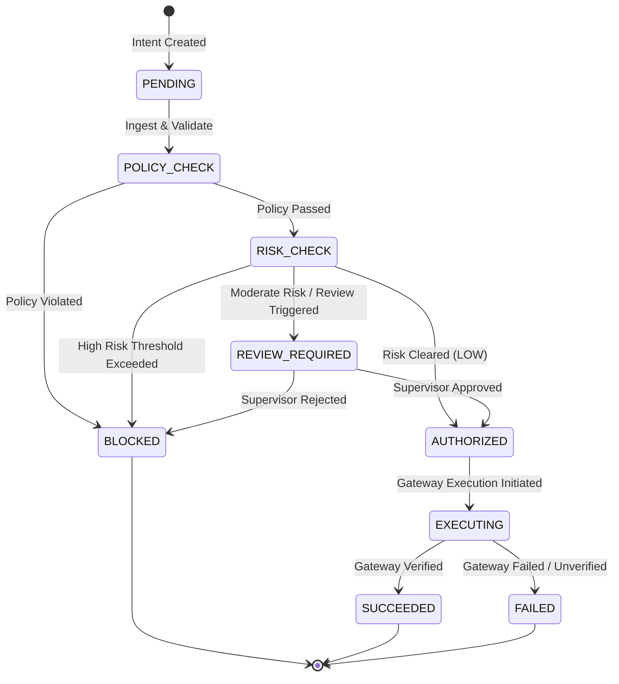

# AgentPay Architecture Specification

## 1. System Overview & Core Thesis

**AgentPay** is a high-assurance financial-agent safety and execution control plane positioned between autonomous AI agents and Razorpay payment infrastructure.

### Core Architectural Axiom
> **"The AI agent may propose a financial action, but it must never have unrestricted authority to execute it."**

```
AI proposes → Deterministic policy decides → Razorpay executes → Verification proves → Audit remembers.
```

---

## 2. Trust Boundaries

```
[ UNTRUSTED ZONE ]
 ┌─────────────────────────────────────────────────────────────┐
 │ User Natural Language Prompt                                │
 │ AI Agent Reasoning & LLM Inference                          │
 │ Frontend Client Applications                                │
 │ Merchant Webhooks / Third-party Callbacks                   │
 └──────────────────────────────┬──────────────────────────────┘
                                │ (Structured Intent JSON)
                                ▼
==================== TRUST BOUNDARY 1: Schema Ingestion ====================
 ┌─────────────────────────────────────────────────────────────┐
 │ Schema Ingestion & Zod Validation Layer                     │
 │ - Strips non-conforming parameters                          │
 │ - Enforces integer minor units (e.g. Paise, Cents)          │
 │ - Fails closed on malformed / coerced / ambiguous data      │
 └──────────────────────────────┬──────────────────────────────┘
                                │ (PaymentIntent DTO)
                                ▼
==================== TRUST BOUNDARY 2: Policy & Risk Engine ================
 ┌─────────────────────────────────────────────────────────────┐
 │ Deterministic Policy Engine (100% Non-Probabilistic)        │
 │ - Agent permission checks (e.g. payment:create)             │
 │ - Spending limits (single-txn, daily velocity)              │
 │ - Merchant whitelist & category restrictions                │
 │ - Currency restrictions (INR only for Razorpay)             │
 │ - Temporal validity & user authorization token verification │
 ├─────────────────────────────────────────────────────────────┤
 │ Deterministic Multi-Signal Risk Engine                      │
 │ - Duplicate detection / Fingerprint matching                │
 │ - Velocity spikes / Anomaly detection                       │
 │ - Risk Scoring (0–30: LOW, 31–60: REVIEW, 61+: HIGH)        │
 ├─────────────────────────────────────────────────────────────┤
 │ Decision Gate (ALLOW / REVIEW / BLOCK)                      │
 └──────────────────────────────┬──────────────────────────────┘
                                │ (If ALLOW)
                                ▼
==================== TRUST BOUNDARY 3: Execution & Verification ============
 ┌─────────────────────────────────────────────────────────────┐
 │ Execution Gateway                                           │
 │ - Idempotency locking & Key caching                         │
 │ - Gateway Adapter (MockGateway / RazorpayPaymentGateway)    │
 ├─────────────────────────────────────────────────────────────┤
 │ Gateway Verification & Reconciliation Subsystem             │
 │ - Provider state verification                               │
 │ - Cryptographic signature validation                        │
 │ - Final state transition (SUCCEEDED / FAILED)               │
 └──────────────────────────────┬──────────────────────────────┘
                                │
                                ▼
==================== IMMUTABLE PERSISTENCE LAYER ==========================
 ┌─────────────────────────────────────────────────────────────┐
 │ Append-Only Audit Ledger (PostgreSQL + Prisma)              │
 │ - State transition records with Request IDs & Timestamps    │
 │ - Cryptographic hash chain for tampering detection          │
 └─────────────────────────────────────────────────────────────┘
```

---

## 3. End-to-End Pipeline Data Flow

```text
User Request ("Buy running shoes under ₹4,000")
   │
   ▼
[1] AI Agent (LLM)
   │  - Generates Structured Intent (JSON)
   │
   ▼
[2] Zod Validation Layer
   │  - Validates schema, field types, bounds, integer paise
   │  - REJECTS if invalid
   │
   ▼
[3] Authorization & Agent Permission Gate
   │  - Checks if Agent holds `payment:create`
   │  - Validates user delegation signature / session
   │
   ▼
[4] Deterministic Policy Engine
   │  - Rule 1: Spending limit (Amount <= Limit)
   │  - Rule 2: Allowed Merchant
   │  - Rule 3: Allowed Currency
   │  - Rule 4: Idempotency uniqueness
   │  - Rule 5: Authorization validity window
   │
   ▼
[5] Deterministic Risk Engine
   │  - Computes risk score based on velocity, duplicates, anomaly signals
   │
   ▼
[6] Decision Engine
   ├── BLOCK → Persist Audit → Return Explanation
   ├── REVIEW → Persist Audit → Queue for Human Supervisor
   └── ALLOW
          │
          ▼
[7] Execution Gateway (Razorpay Adapter)
   │  - Acquires Idempotency Lock
   │  - Creates Razorpay Order / Captures Payment
   │
   ▼
[8] Verification Engine
   │  - Verifies payment status and webhook/signature
   │  - Reconciles final financial state
   │
   ▼
[9] Immutable Audit Ledger
   │  - Records complete trace from intent to execution
   │
   ▼
[10] Client Response & Decision Trace
```

---

## 4. State Machine Definition

A `PaymentIntent` follows strict, deterministic state transitions:



### State Invariants
- Direct transition from `PENDING` to `EXECUTING` is mathematically impossible.
- Transition to `SUCCEEDED` requires affirmative cryptographic and provider verification.
- Any unexpected error immediately halts execution and enters `FAILED` or `REVIEW_REQUIRED`, never optimistic `SUCCEEDED`.

---

## 5. Monetary Arithmetic Standard

All financial calculations MUST use integer minor units (Paise):
- `₹1.00` = `100` paise
- `₹3,999.00` = `399900` paise
- `₹0.50` = `50` paise

**Floating-point numbers (`number` with decimals) are strictly prohibited for monetary calculations and database storage.**
